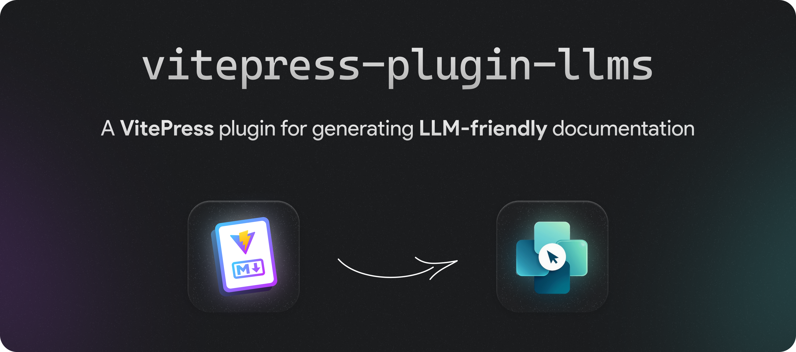

<!-- markdownlint-capture -->
<!-- markdownlint-disable no-inline-html heading-start-left first-line-h1 -->
<div align="center">

  <a href="https://npmjs.com/package/vitepress-plugin-llms">
    <!-- https://docs.github.com/en/get-started/writing-on-github/getting-started-with-writing-and-formatting-on-github/basic-writing-and-formatting-syntax#specifying-the-theme-an-image-is-shown-to -->
    <picture>
      <source media="(prefers-color-scheme: dark)" srcset="assets/hero-dark.png">
      <source media="(prefers-color-scheme: light)" srcset="assets/hero-light.png">
      
    </picture>
  </a>

# 📜 vitepress-plugin-llms

[](https://www.npmjs.com/package/vitepress-plugin-llms) [](https://npmjs.com/package/vitepress-plugin-llms) [](https://github.com/okineadev/vitepress-plugin-llms/actions/workflows/ci.yml) [](https://bun.sh) [](https://biomejs.dev/) [](https://github.com/okineadev/vitepress-plugin-llms?sponsor=1)
</div>
<!-- markdownlint-restore -->

## 📦 Installation

```bash
bun install vitepress-plugin-llms --dev
npm install vitepress-plugin-llms --save-dev
```

## 🛠️ Usage

Add the Vite plugin to your VitePress configuration (`.vitepress/config.ts`):

```ts
import { defineConfig } from "vitepress";
import llmstxt from "vitepress-plugin-llms";

export default defineConfig({
  vite: {
    plugins: [llmstxt()],
  },
});
```

Done!

Now, thanks to this plugin, the LLM version of the website documentation is automatically generated

### Plugin Settings

See [`src/types.d.ts`](src/types.d.ts)

#### Example Configuration

Here is an example of how to configure the plugin with custom settings:

```ts
import { defineConfig } from "vitepress";
import llmstxt from "vitepress-plugin-llms";

export default defineConfig({
  vite: {
    plugins: [
      llmstxt({
        generateLLMsFullTxt: false,
        ignoreFiles: ["blog/*"],
        customLLMsTxtTemplate: `# {title}\n\n{description}\n\n## Custom TOC\n\n{toc}`,
      }),
    ],
  },
});
```

This configuration does the following:
- `generateLLMsFullTxt: false`: Disables the generation of the `llms-full.txt` file.
- `ignoreFiles: ["blog/*"]`: Ignores all files in the `blog` directory.
- `customLLMsTxtTemplate`: Uses a custom template for the `llms.txt` file.

## 🚀 Why `vitepress-plugin-llms`?

LLMs (Large Language Models) are great at processing text, but traditional documentation formats can be too heavy and cluttered. `vitepress-plugin-llms` generates raw Markdown documentation that LLMs can efficiently process

The file structure in `.vitepress/dist` folder will be as follows:

```plaintext
.vitepress/dist
├── ...
├── llms-full.txt            // A file where all the website documentation is compiled into one file
├── llms.txt                 // The main file for LLMs with all links to all sections of the documentation for LLMs
├── markdown-examples.html   // A human-friendly version of `markdown-examples` section in HTML format
└── markdown-examples.md     // A LLM-friendly version of `markdown-examples` section in Markdown format
```

### ✅ Key Features

- ⚡️ Easy integration with VitePress
- 🤖 An LLM-friendly version is generated for each page
- 📝 Outputs `llms.txt` with section links
- 📖 Outputs `llms-full.txt` with all content in one file

## 📖 llmstxt.org Standard

This plugin follows the [llmstxt.org](https://llmstxt.org/) standard, which defines the best practices for LLM-friendly documentation.

## ❤️ Support

If you like this project, consider supporting it by starring ⭐ it on GitHub, sharing it with your friends, or [buying me a coffee ☕](https://github.com/okineadev/vitepress-plugin-llms?sponsor=1)

## 🤝 Contributing

You can read the instructions for contributing here - [CONTRIBUTING.md](./CONTRIBUTING.md)

## 📜 License

[MIT License](./LICENSE) © 2025-present [Yurii Bogdan](https://github.com/okineadev)
